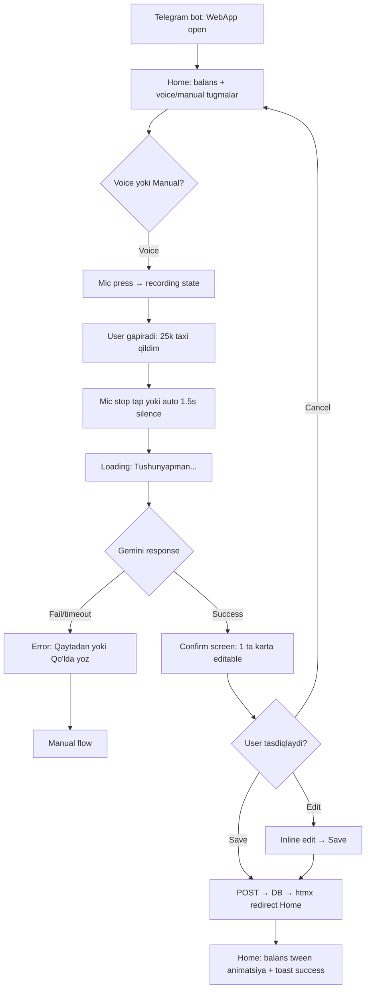
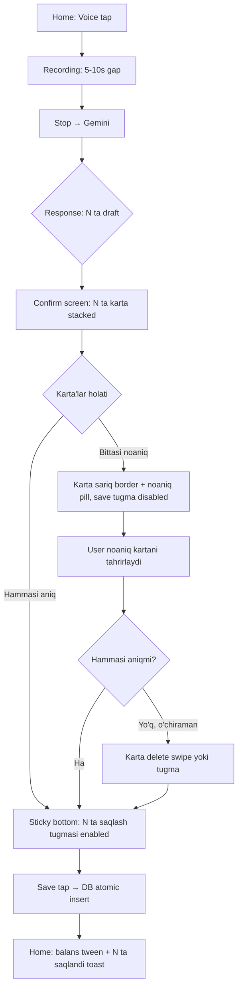
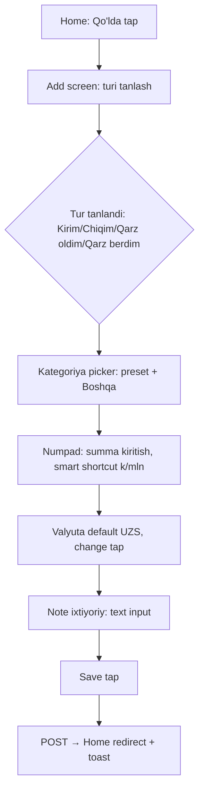
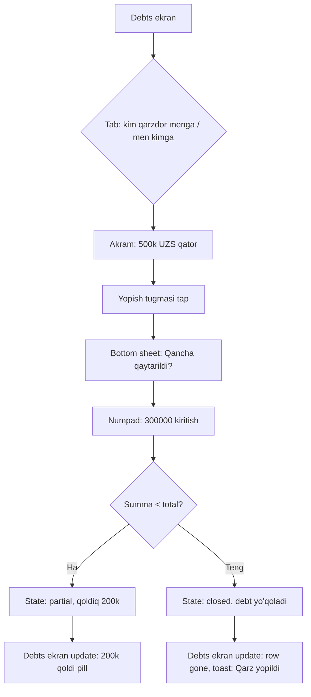
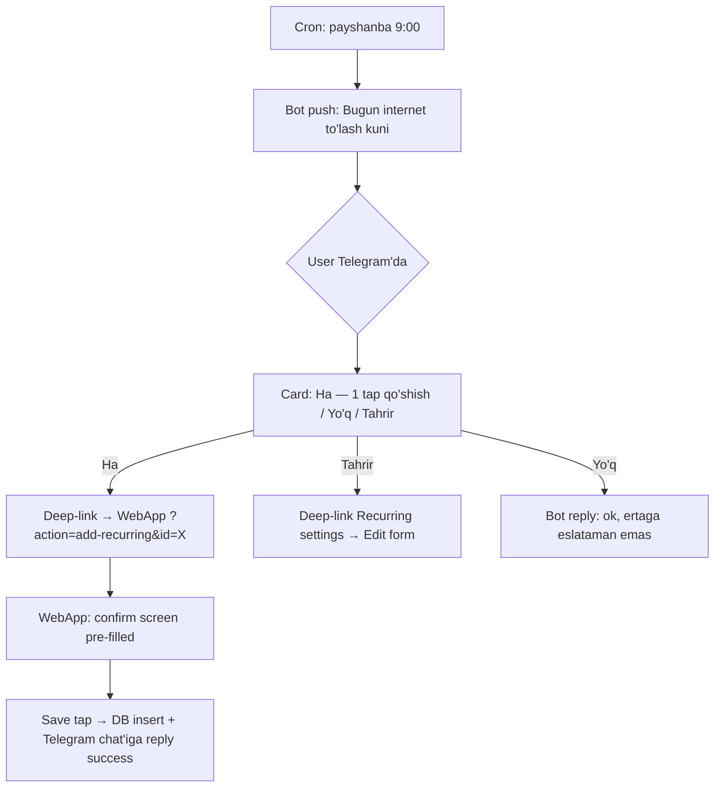
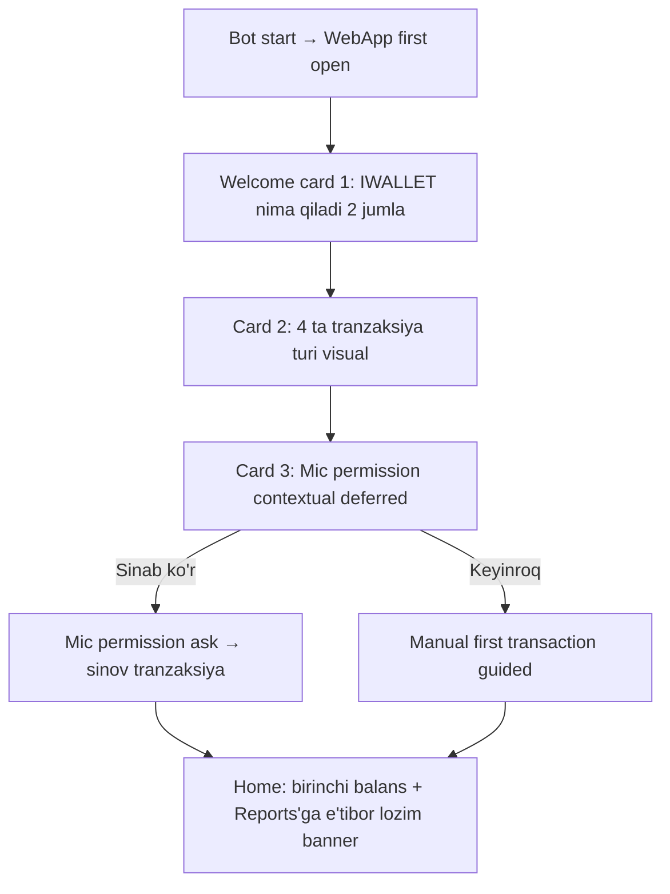

---
stepsCompleted:
  - step-01-init
  - step-02-discovery
  - step-03-core-experience
  - step-04-emotional-response
  - step-05-inspiration
  - step-06-design-system
  - step-07-defining-experience
  - step-08-visual-foundation
  - step-09-design-directions
  - step-10-user-journeys
  - step-11-component-strategy
  - step-12-ux-patterns
  - step-13-responsive-accessibility
  - step-14-complete
inputDocuments:
  - docs/product-brief.md
  - docs/prd.md
project_name: 'IWALLET'
user_name: 'Eric'
date: '2026-06-25'
---

# UX Design Specification — IWALLET

**Author:** Eric
**Date:** 2026-06-25
**Status:** Complete (single-session, planning faza, polish bilan)

---

## Executive Summary

### Project Vision

IWALLET — Telegram WebApp shaklidagi shaxsiy moliyaviy tracker. Mobile viewport (360-430px), o'zbek tilida, voice va manual kiritishni teng huquqli flow sifatida taklif qiladi. Kun davomida 10 soniyada bir tranzaksiya yozish — odat shakliga aylanadigan asbob. UX'da asosiy maqsad: **friction ~0**, har bir tap'da feedback, hech qachon dead-end.

### Target Users

**v1 (oy 1-5):** Eric (founder) + 5-10 closed beta foydalanuvchi. O'zbek tilida gaplashuvchi, Telegram'da kun bo'yi turuvchi, oddiy moliyaviy ko'rinish istovchi. Tech-savvy darajasi: o'rta (Telegram bot ishlatadi, lekin native finance app ishlatishni xohlamaydi). Yosh: 22-40. Asosan smartphone.

**v2 (oy 6+):** O'zbekistondagi keng auditoriya — mahalliy distributor'lar, freelancer'lar, oddiy ish haqi oluvchilar. Pul boshqarish istagi bor, lekin Excel/qog'oz friction'iga toqat qilolmaydi.

### Key Design Challenges

1. **Voice UX Telegram WebApp ichida:** Mic permission iOS Safari WebView'da qo'rqitadi. Onboarding'da kontekst-bilan tushuntirish kerak.
2. **Multi-transaction confirm screen:** 3-5 ta draft kartani mobile viewport'da editable qilib ko'rsatish — scroll, edit, batch confirm — UX nozik.
3. **Public space friction:** Ofis/taxi'da voice ishlatib bo'lmaydi (daromad maxfiy). Manual flow voice bilan **teng vaznda** ko'rinishi kerak.
4. **Qarz mexanikasi vizual ravshanligi:** Borrowed → balansga +, lent → expense, repayment → special. Foydalanuvchi balansda nima borligini hech ikkilanmasdan tushunishi kerak.
5. **3 ta valyuta UI noisesiz:** Switcher har joyda kerak, lekin xira emas. Default UZS doim ravshan.
6. **Reports — yetarli ma'lumot yo'q empty state:** Yillik report 1 oyda ham mavjud, lekin "ma'lumot to'planmoqda" message bilan tushunarli bo'lishi kerak.

### Design Opportunities

1. **Voice'da hech kim qila olmaydigan UX:** O'zbekcha voice + Telegram WebApp + multi-tx parsing — birinchi marta qilinadi. UX patterns'ni biz o'rnatamiz.
2. **Telegram-native interactions:** Bot push deep-link, share via Telegram, theme adaptation — distribution channel uchun bonus.
3. **"Aha" moment chiroyli ekran:** Birinchi multi-tx voice → 3 ta karta paydo bo'lishi → user "Wow" deydi. Bu marketing-grade moment.
4. **Numbers as hero:** Personal finance — raqamlar asosiy content. Tabular numerals, smart formatting (1,250,000 → "1.25 mln") — kuchli vizual.

---

## Core User Experience

### Defining Experience

**Bir gap:** *Mic'ni 2 soniya bos, gapirib qo'y, tasdiqla — pulingni yozding.*

Eric foydalanuvchi qadamlari:

1. Telegram bot chat'idan WebApp tugmasini bossadi → 1.5s ichida Home ekran (sof balans katta, voice/manual ikki teng tugma).
2. Mic katta tugmasini bossadi (yoki ✏️ Qo'lda).
3. Voice: "Bugun 25k taxi qildim" → 2-3s'da confirm screen → tasdiqlash → Home'ga qaytadi.
4. Hammasi 8-10 soniya.

Bu defining experience'ni 100% to'g'ri qilsak — boshqa hammasi tartibga keladi.

### Platform Strategy

- **Telegram WebApp only** — desktop'da ham mobile viewport ochiladi
- **Touch-first** — minimum 44×44px tap target, gesture-friendly (swipe to delete history item)
- **Mobile viewport lock:** width 360-430px, max-width container 430px
- **No PWA, no offline** v1 da — Telegram WebApp constraint
- **Light theme only** v1 — Telegram theme adaptation v1.1 ga qoldiriladi

### Effortless Interactions

| Action | Effortless target |
|---|---|
| App ochish | 1 tap (bot button) |
| Voice tranzaksiya | 1 tap mic + 1 gap + 1 tap save = 3 amal |
| Manual tranzaksiya | 3-4 tap (turi → kategoriya → summa → save) |
| Balans ko'rish | 0 amal (Home'da darrov) |
| Qarz close | 1 tap (Debts ekranda "Yopish" tugmasi) |
| Currency switch | 1 tap (Home'dagi switcher) |

### Critical Success Moments

1. **Birinchi tranzaksiya saqlandi (kun 1):** "Aha, oson ekan" — onboarding success.
2. **Multi-tx voice birinchi muvaffaqiyat (hafta 1):** 3 ta tranzaksiya bir gapda → "Wow" — viral moment.
3. **Oy oxiri sof balans ko'rinishi (kun 30):** "Mana qaerga ketibdi" — retention moment.
4. **Qarz qaytarish kuni eslatma → 1 tap close (hafta 2-3):** "Bu eslatib turibdi" — habit reinforcement.

### Experience Principles

1. **Friction is the enemy** — har qadamda "yana kerakmi" so'ra. 4 tap'dan oshmasin.
2. **Voice and manual are equals** — hech qaysi biri "default" emas. Kontekst tanlaydi.
3. **Numbers come first** — pul tracker'da raqamlar asosiy. Kategoriya, sana — yordamchi.
4. **Confirm, don't auto-save voice** — voice noaniqlik bor, hech qachon user tasdiqlamasdan saqlanmasin.
5. **No dead-ends** — har error/empty state'da keyingi qadam bor.
6. **Telegram-native, not Telegram-styled** — Telegram'ning UI patterns'iga moslashish shart emas, lekin Telegram lifecycle (back button, MainButton) hisobga olinadi.

---

## Desired Emotional Response

### Primary Emotional Goals

| Emotsiya | Qachon | Nima orqali |
|---|---|---|
| **Yengillik** ("uh, oson ekan") | Birinchi voice tranzaksiya | 8 soniyalik flow, instant feedback |
| **Nazorat** ("men o'z pulimni bilaman") | Home'da balansga qarash | Aniq raqamlar, top 3 kategoriya |
| **Ishonch** ("hech narsa yo'qolmaydi") | Voice confirm screen | Edit qila olish, batch atomic save |
| **Mamnunlik** ("yana qildim") | Tranzaksiya save bo'lganda | Mikro-animatsiya, balans yangilanishi |

### Emotional Journey Mapping

```
Onboarding (1-chi marta)
  └─ Qiziqish (chiroyli ekran) → Engil shubha (mic permission?) → Yengillik (manual bilan ham bo'ladi)

Birinchi voice tranzaksiya
  └─ Engil tashvish (Gemini eshitarmikin?) → Hayron (eshitdi-ku!) → Mamnun (saqlandi)

Multi-tx voice "Aha"
  └─ Qiziqish (3 ta karta?) → Hayron (haqiqatdan-ku) → Brag-worthy

Kun 30 (oy oxiri Reports)
  └─ Hayron (qaerga ketdi?) → Tushunish → Motivatsiya (keyingi oy o'zgartiraman)

Qarz qaytarish eslatmasi (push)
  └─ Yodga olish (rahmat eslatib) → Tezda close → Tartib

Error / voice fail
  └─ Bir oz noqulay (eshitmadi) → Tinch (manual ochiq) → Yana sinab ko'raman
```

### Micro-Emotions

| Prioritet | Emotsiya | Aksincha (preventiv) |
|---|---|---|
| Yuqori | Ishonch | Skeptizm ("pulim qayoqqa ketdi?") |
| Yuqori | Mamnunlik | Frustratsiya (xato qilsa) |
| Yuqori | Tartib | Chalkashlik (qarz va balans aralashishi) |
| O'rta | Hayron | Zerikish (oddiy UI) |
| O'rta | Tezlik hissi | Sustlash (loading spinners ko'p) |

### Design Implications

- **Ishonch uchun:** har save'da yashil checkmark + summary, har voice'da edit imkoniyati, debt mexanika'ni vizual ajratish.
- **Mamnunlik uchun:** balans yangilanish animatsiyasi (200ms tween), save success haptic-like flash.
- **Tartib uchun:** rang-kodlash (kirim yashil, chiqim qora-qizg'ish, qarz amber), Home'da 3 ta aniq raqam.
- **Tezlik hissi uchun:** htmx swap 200ms ostida, voice transcript darrov ko'rinadi (Gemini stream'i kelganda).

### Emotional Design Principles

1. **Calm over flashy** — finance trust kerak, gamification yo'q.
2. **Confident typography** — raqamlar katta va aniq, ikkilanish yo'q.
3. **Warm minimal** — sovuq corporate emas, lekin overly cute ham emas. O'zbek context — issiq, professional.
4. **Friction-free recovery** — har xato'da "qaytadan urinish" bir bosish'da bo'lsin.

---

## UX Pattern Analysis & Inspiration

### Inspiring Products Analysis

**1. Cash App (USA)**
- Single hero amount on Home — raqam katta, atrofda bo'sh joy ko'p
- Color-as-personality (yashil brand) — finance bilan trust assotsiatsiyasi
- Bottom action buttons — thumb reach
- ❌ Voice yo'q, multi-currency yo'q

**2. Revolut**
- Multi-currency switching — Home'da tap orqali
- Beautiful charts, smooth transitions
- Card-based history
- ❌ Onboarding murakkab, mobile-only emas

**3. YNAB (You Need A Budget)**
- Strict expense category UX
- Reports — pie + bar combination ko'rinishi
- ❌ Voice yo'q, friction yuqori

**4. Telegram'ning o'zi**
- Voice messages — bizning voice flow uchun mental model
- Swipe interactions
- Bottom sheet patterns (modal'lar pastdan ko'tariladi)
- Native MainButton — sticky CTA

**5. Notion mobile**
- Slash command UX → bizning voice intent parse'iga mental model
- Empty states chiroyli (illustration emas, text)

### Transferable UX Patterns

**Navigation:**
- Cash App'cha hero amount Home'da
- Telegram'cha bottom sheet modal'lar (Add transaction)
- Bottom nav (5 ekran), Settings bosh menyu'ga

**Interaction:**
- Telegram voice'cha mic UX (tap to talk, vizual pulse)
- Notion'cha "natural language → structured" mental model
- Revolut'cha currency tap-to-switch

**Visual:**
- Cash App'cha tabular numerals, large hero raqam
- Telegram theme'dan: rounded corners (12-16px), subtle shadows
- YNAB'dan: rang-kodlash konsistensiyasi (har kategoriya ranggi bor)

### Anti-Patterns to Avoid

- ❌ **Hamburger menu** — mobile'da find'lash qiyin, bottom nav yaxshi
- ❌ **Modal stacks** — bir modal ustiga ikkinchisi (debug do'zaxi)
- ❌ **Confirmation for trivial actions** — "Saqlash uchun bossangizmi?" yo'q
- ❌ **Loading spinners 1s'dan ortiq** — htmx swap kerak, skeleton/optimistic UI
- ❌ **Native iOS/Android styling** — Telegram WebApp cross-platform, biz o'z stilimizni qilamiz
- ❌ **Notification badge'lar Home'da** — finance app trust talab qiladi, "10 unread" stress beradi
- ❌ **Gamification (badges, streaks)** — pul jiddiy mavzu, o'yin emas
- ❌ **Auto-categorize emas** — voice'da Gemini taklif qiladi, lekin user tasdiqlamaguncha "Boshqa" qoladi

### Design Inspiration Strategy

**Adopt:**
- Cash App: hero amount centered, generous padding
- Telegram: voice mic UX, bottom sheet modals, sticky MainButton
- Notion: empty states minimal text-based, natural language input

**Adapt:**
- YNAB color-coded categories — soddalashtir, 5-7 rang ishlatish
- Revolut currency switch — Home'da label-as-button, tap toggle

**Avoid:**
- Hamburger menu, modal stacks, loading spinners, gamification, badge spam

---

## Design System Foundation

### Design System Choice

**Tanlov: Tailwind CSS + custom token layer (themeable approach)**

Tailwind UI emas (paid + React-bound). Faqat **Tailwind CSS framework + custom design tokens**. Component'lar Django template'larda qo'lda yoziladi (htmx mos), lekin atomic CSS bilan tez.

### Rationale for Selection

| Mezon | Tailwind CSS + custom | Sabab |
|---|---|---|
| Stack mosligi | ✅ | Django templates + htmx — JS framework yo'q, Tailwind CDN/CLI fits |
| Bundle size | ✅ | JIT mode purge → < 30KB gzipped |
| Customization | ✅ | Token-based (config.js), brand uniqueness oson |
| Mobile-first | ✅ | Built-in mobile-first breakpoint syntax |
| Speed | ✅ | Component yozish tez, copy-paste pattern'lar |
| Accessibility | ⚠️ | Tailwind o'zi ARIA bermidi — biz qo'lda yozamiz (NFR20) |
| Solo dev fit | ✅ | Designer alohida emas, dev kichik komponentlar yozadi |

Bootstrap, Bulma — eskirgan, custom theme zo'r emas. Material — overpowered, Telegram'da yaramaydi. Pico CSS — minimal, lekin design system yetarli emas.

### Implementation Approach

```
static/
├── css/
│   ├── tokens.css        # CSS variables (colors, spacing, fonts)
│   ├── tailwind.config.js # tokens'ni Tailwind'ga import qiladi
│   └── app.css           # custom component classes (htmx + a11y)
├── js/
│   ├── htmx.min.js       # 14KB
│   ├── alpine.min.js     # 12KB — minimal state (dropdowns, modals)
│   └── voice-recorder.js # MediaRecorder wrapper, ~5KB
```

Build: `tailwindcss -i app.css -o build.css --watch` (CLI), Django `STATICFILES` orqali serve.

### Customization Strategy

- **Brand color** primary — fresh emerald (trust + financial growth)
- **Numbers font** — JetBrains Mono yoki Inter Tabular (tabular-nums activated)
- **Border radius** — `rounded-2xl` default (16px) — friendly, Telegram-vibing
- **Spacing scale** — 4px base, common: 4, 8, 12, 16, 24, 32, 48
- **Shadows** — subtle (`shadow-sm`, `shadow-md`), no harsh drop-shadows

---

## Defining Core Experience

### Core Defining Experience

**Bir interaksiya: Voice → Confirm → Save.** Bu nailed bo'lsa, hammasi tartibga keladi.

```
Home (1 tap) → Mic active (1 tap) → Speech (2-5s)
   → Stop (auto or 1 tap) → Confirm screen (paint < 1s after Gemini response)
   → Save (1 tap) → Home updated (instant)
```

### User Mental Model

**O'zbek foydalanuvchining mental modeli:**
- "Voice deganda — Telegram'cha golosovoye" (audio yuborish, javob kutish)
- "Tranzaksiya yozish deganda — qog'ozga summa, sana, izoh" (3-4 maydon)
- "Pul yozish jiddiy" — har save trust talab qiladi, confirm step kutilgan

Biz bu modelga **mos kelamiz** (golosovoye'cha mic UX, 3-4 maydonli confirm), lekin **kengaytiramiz** (multi-tx — bitta gapda bir nechta tranzaksiya, mental model'da yo'q, lekin demonstratsiya orqali tez egallanadi).

### Success Criteria

- Voice transcription < 3s (mic stop → confirm screen)
- Confirm screen 0 noaniqlikli kartalar uchun — user "Tasdiqlash" tugmasini darrov ko'radi (sticky bottom)
- Edit per-card — 1 tap (inline)
- Save → Home redirect — instant (htmx swap, no full reload)
- Birinchi voice tranzaksiya soni — Home'dan boshlanib save'gacha **< 12 soniya** wall clock

### Novel UX Patterns

| Pattern | Novel'mi yoki Established'mi | Strategiya |
|---|---|---|
| Tap-to-talk mic | Established (WhatsApp, Telegram) | Adopt |
| Multi-tx confirm screen | **Novel** (kam joyda) | Educate via onboarding |
| Per-card inline edit | Established (Notion, Linear) | Adopt |
| Sticky batch confirm | Established (Mobile forms) | Adopt |
| Currency switch on Home | Established (Revolut) | Adapt — minimal label |
| 3-ta balans raqami Home'da | **Novel** (qarz model uchun) | Onboarding'da tushuntirish |

### Experience Mechanics

**1. Initiation (mic UX)**
- Mic tugmasi 96×96px circle, Home pastida sticky
- Tap → mic icon → recording state: pulse animatsiya (yashil halqa kengayadi), waveform vizual (oddiy 5-bar amplitude)
- Stop usul: (a) ikkinchi tap, (b) 60s auto-stop, (c) silence detection 1.5s (optional, v1.1 ga qoldiriladi)

**2. Interaction (speech → transcript)**
- Stop bosilganda darrov "Tinglayapman..." → "Tushunyapman..." (Gemini'ga yuborish)
- Real audio streaming optional — v1 da batch send (recording → POST audio)
- Loading state: skeleton confirm cards (1-3 ta gray placeholder)

**3. Feedback (confirm screen)**
- Cards stack: har biri full-width, gap-3 (12px between)
- Karta strukturasi: top emoji+kategoriya, big amount (right-aligned), bottom note+date
- Noaniq maydon: sariq border + "noaniq" pill
- Sticky bottom: `[N ta saqlash]` primary tugmasi + `[Bekor qilish]` ghost

**4. Completion (save)**
- Tap "Saqlash" → button loading 200-400ms → success haptic (vibration if available) → htmx redirect Home
- Home'da balans 300ms tween animation (eski → yangi)
- Top'da toast (3s): "✓ 3 ta tranzaksiya saqlandi"

---

## Visual Design Foundation

### Color System

**Brand identitet:** *Trust + friendly Uzbek warmth + financial clarity.* Cold corporate emas, overly playful emas.

**Primary palette:**

| Token | Light | Maqsad |
|---|---|---|
| `--color-bg` | `#FAFAF7` | App background (warm off-white, sariq tomonga 1-2°) |
| `--color-surface` | `#FFFFFF` | Card, modal background |
| `--color-text` | `#0F172A` | Primary text (slate-900) |
| `--color-text-muted` | `#64748B` | Secondary text (slate-500) |
| `--color-border` | `#E2E8F0` | Subtle borders (slate-200) |
| `--color-primary` | `#059669` | **Emerald-600** — brand, primary buttons |
| `--color-primary-hover` | `#047857` | Emerald-700 |
| `--color-income` | `#10B981` | Emerald-500 — kirim ranggi |
| `--color-expense` | `#0F172A` | Slate-900 — chiqim ranggi (qora, jiddiy) |
| `--color-debt` | `#F59E0B` | Amber-500 — qarz ranggi (warning-like, ajraladi) |
| `--color-danger` | `#DC2626` | Red-600 — delete, destructive |
| `--color-warning-bg` | `#FEF3C7` | Amber-100 — noaniq karta background |
| `--color-success-bg` | `#D1FAE5` | Emerald-100 — save success toast |

**Rang qoidalari:**
- Kirim har joyda **emerald-500** (yashil)
- Chiqim — **slate-900** (qora, neutral) — qizg'ish ishlatmaymiz (anti-pattern: every expense panic emas)
- Qarz — **amber-500** (sariq accent) — vizual ravshan ajraladi
- Primary action — **emerald-600** (brand)
- Background ko'p — generous whitespace
- Card shadow minimal — `shadow-sm` (subtle), heavy shadow yo'q

**Contrast:** har biri WCAG AA 4.5:1 dan yuqori bo'ladi (text-on-bg testlangan).

### Typography System

**Stack:**

```css
--font-display: 'Inter', system-ui, sans-serif;
--font-numeric: 'Inter', sans-serif; /* font-feature-settings: 'tnum' */
--font-mono: 'JetBrains Mono', ui-monospace, monospace; /* code/debug only */
```

**Why Inter:**
- O'zbek (lotin + kiril) qo'llab-quvvatlanadi
- Variable font — single file, multiple weights
- Tabular numerals built-in (`font-feature-settings: 'tnum'`)
- Mobile readability outstanding

**Type scale:**

| Token | Size / line-height | Weight | Use |
|---|---|---|---|
| `text-hero` | 48px / 56px | 700 | Home main balance |
| `text-3xl` | 30px / 36px | 600 | Confirm card amount, report header |
| `text-2xl` | 24px / 32px | 600 | Section heading |
| `text-xl` | 20px / 28px | 500 | Card title, page heading |
| `text-lg` | 18px / 28px | 500 | Settings group, button text |
| `text-base` | 16px / 24px | 400 | Body, form input |
| `text-sm` | 14px / 20px | 400 | Caption, secondary info |
| `text-xs` | 12px / 16px | 500 | Pills, badge, micro-label |

**Number formatting:**
- Always tabular-nums (`font-variant-numeric: tabular-nums`)
- Thousand separator: ` ` (thin space) — `1 250 000 UZS`
- Large numbers smart format: `1.25 mln UZS` (≥ 1,000,000) — agar context'da joy ozsa
- Decimal hidden if `.00` — `25 000 UZS` not `25 000.00`

### Spacing & Layout Foundation

**Base unit: 4px**

| Token | Pixel | Use |
|---|---|---|
| `space-0` | 0 | reset |
| `space-1` | 4px | inline gap |
| `space-2` | 8px | tight gap |
| `space-3` | 12px | card internal gap |
| `space-4` | 16px | section gap, card padding |
| `space-5` | 20px | container padding |
| `space-6` | 24px | section break |
| `space-8` | 32px | large break |
| `space-12` | 48px | hero section |

**Layout principles:**
- Container max-width: `430px`, centered
- Side padding: `space-5` (20px) — minimum thumb-reach margin
- Vertical rhythm: `space-4` (16px) between sections, `space-6` (24px) between groups
- Card border-radius: `rounded-2xl` (16px)
- Card padding internal: `space-4` (16px)
- Bottom sticky CTA — `space-5` (20px) bottom + `safe-area-inset-bottom`

### Accessibility Considerations

- Touch target ≥ 44×44px (icon button — 44, voice mic — 96)
- Color contrast ≥ 4.5:1 (WCAG AA)
- Focus indicator visible (Tailwind `focus-visible:ring-2 ring-emerald-500`)
- Icon-only buttons have aria-label
- Voice — built-in alternative for motor impairment
- Form labels associated (`<label for>`)
- Error messages screen reader announced (`aria-live="polite"`)
- Heading hierarchy correct (no skipping levels)

---

## Design Direction Decision

### Design Directions Explored

3 ta direction qisqacha:

**Direction A — "Calm Card Stack"**
- Light bg, white cards, generous space
- Hero balance centered, small currency switcher pill
- Bottom mic button + manual button side-by-side equal
- Bottom nav (5 tabs) sticky

**Direction B — "Hero Voice"**
- Top: balans medium-large
- Center: huge mic button (140×140)
- Manual: text link below, less visual weight
- Voice-first tilt
- ❌ Voice-equal modelga zid

**Direction C — "Categories First"**
- Home — kategoriya pie chart hero
- Balance pastda
- ❌ Pul tracker'da balans hero, kategoriya context

### Chosen Direction

**Direction A — Calm Card Stack** (tasdiqlangan).

### Design Rationale

- **Voice-equal** — A variant'da mic va manual side-by-side teng → mukammal mos
- **Balance hero** — primary motivatsiya (qaerga ketdi?), Cash App'cha proven pattern
- **Generous space** — calm/trust emotsiyasi, finance UX best practice
- **Bottom nav 5 tabs** — Telegram WebApp mobile pattern, thumb reach

### Implementation Approach

- Tailwind utility-first, custom component classes `app.css`'da
- Home, Add, History, Debts, Reports, Settings — har biri `templates/{name}/index.html` Django template
- htmx swap'lar dynamic qismlar (confirm screen, history filter, debt close action)
- Alpine.js minimal — modal open/close, dropdown state, toast

---

## User Journey Flows

### Journey 1 — Voice Single Transaction (Happy Path)



### Journey 2 — Voice Multi-Transaction (Power Use)



### Journey 3 — Manual Input (Privacy / Public Space)



### Journey 4 — Debt Close (Partial Repayment Edge)



### Journey 5 — Recurring Reminder (Bot → WebApp Deep-Link)



### Journey 6 — Onboarding (First Run)



### Journey Patterns

| Pattern | Qaerda | Standart strategiya |
|---|---|---|
| Sticky bottom CTA | Add, Confirm, Settings forms | `bottom: 0 + safe-area-inset-bottom`, primary button full-width |
| Bottom sheet modal | Debt close, recurring add, currency switch | Slide up from bottom, dismiss tap outside |
| Toast feedback | Save success, debt closed | Top 3s fade, no close button |
| Skeleton loading | Voice confirm, history fetch | Gray placeholder cards, no spinner |
| Empty states | Reports < 3 oy data, History empty | Centered text + CTA ("Birinchi tranzaksiyani qo'shing") |
| Error recovery | Voice fail, network error | "Yana urinish" + "Qo'lda" — har doim 2 ta path |
| Deep-link from bot | Recurring confirm, debt remind | Query param → server-side intent → pre-filled action screen |

### Flow Optimization Principles

1. **Maks 4 tap to value** — voice 3, manual 4
2. **Hech qachon dead-end** — har error'da next action
3. **Optimistic UI** — save bosilgandan keyin Home darrov yangilanadi, server confirm parallel
4. **Loading skeleton, not spinner** — perceived speed yuqori
5. **Sticky CTA mobile-first** — thumb reach prioriteti

---

## Component Strategy

### Design System Components (Tailwind base)

Tailwind utility classes orqali tez quriladigan elementlar — alohida component layer emas:
- `Button` variants (primary, secondary, ghost, danger)
- `Card` (rounded-2xl, padding-4, shadow-sm)
- `Input` (border, focus ring, mobile keyboard)
- `Badge / Pill` (small label)
- `Toast` (Alpine.js controlled)
- `Bottom Sheet` (Alpine.js + Tailwind translate)

### Custom Components (IWALLET-specific)

#### `BalanceHero`
- **Maqsad:** Home top — sof balans katta ko'rsatish
- **Anatomy:** Currency switcher pill (top-right) · `text-hero` raqam · 3 ta mini-stat row (naqd · sof · qarz holati)
- **States:** Loading (skeleton), data, currency switching (number tween 300ms)
- **Variants:** Compact (Reports header'ida)
- **A11y:** `aria-label="Sof balans 12 million 500 ming so'm"` raqam screen reader uchun

#### `VoiceButton`
- **Maqsad:** Voice recording trigger
- **Anatomy:** 96×96 circle, mic icon, ring (idle), pulse animation (recording)
- **States:** idle, recording (yashil pulse), processing (loading dots), error (red shake)
- **A11y:** `aria-pressed`, `aria-label="Ovoz bilan tranzaksiya qo'shish"`

#### `TransactionCard`
- **Maqsad:** History, confirm screen items
- **Anatomy:** Left emoji + category, right amount (currency), bottom row note + date
- **States:** default, editable (border focus), uncertain (amber border), draft (dotted)
- **Variants:** Compact (history list), expanded (confirm screen), debt (amber accent)
- **Swipe:** swipe-left → delete (history)
- **A11y:** semantic `<article>`, screen reader announces summary

#### `ConfirmScreen`
- **Maqsad:** Multi-tx voice tasdiqlash
- **Anatomy:** Top header ("N ta tranzaksiya"), stacked `TransactionCard`s (vertical), sticky bottom CTA
- **States:** all valid (CTA enabled), some uncertain (CTA disabled + warning text)
- **A11y:** ARIA live region — har edit'dan keyin summary update

#### `DebtRow`
- **Maqsad:** Debts ekran qator
- **Anatomy:** Counterparty name + avatar circle (initials) · summa amber · "Yopish" tugmasi
- **States:** open, partial (qoldiq pill), closed (faded, archive)
- **A11y:** action button labeled

#### `CategoryPicker`
- **Maqsad:** Add screen, Settings
- **Anatomy:** Grid of category chips (emoji + label), "Boshqa" oxirida
- **States:** default, selected (emerald-500 border)
- **Variants:** Modal (Add flow), inline (Settings)

#### `Numpad`
- **Maqsad:** Summa kiritish (manual + edit)
- **Anatomy:** 4×3 grid + `k` `mln` shortcut + delete
- **States:** active, error (red border on invalid)
- **A11y:** `inputmode="decimal"` plus visual numpad

#### `CurrencySwitcher`
- **Maqsad:** Home, Reports — display currency switch
- **Anatomy:** Pill button (UZS) · tap → bottom sheet 3 ta variant
- **States:** default, active

#### `RecurringCard`
- **Maqsad:** Settings list item + bot push template
- **Anatomy:** Schedule (har dushanba) + nom + summa + edit/delete actions

#### `ReportChart`
- **Maqsad:** Reports — pie, bar, trend
- **Anatomy:** SVG-based (no Chart.js — overkill), Tailwind colors
- **Variants:** pie (kategoriya taqsimot), bar (kunlik xarajat), line (trend)
- **A11y:** SVG title + desc, table fallback below

#### `EmptyState`
- **Maqsad:** Reports < 3 oy, History empty
- **Anatomy:** Centered text ("Ma'lumot to'planmoqda") + 1 ta CTA
- **Sodda, illustration yo'q** — Notion-cha minimal

#### `Toast`
- **Maqsad:** Save success, error feedback
- **Anatomy:** Top fixed, fade in/out, 3s
- **Variants:** success (emerald), error (red), info (slate)

### Component Implementation Strategy

- Har component — Django partial template (`templates/components/transaction_card.html`)
- htmx-friendly: each component bo'lib qo'shilishi mumkin (oob swap)
- Alpine.js minimal state — modals, dropdowns, toasts (no Vue/React)
- CSS — Tailwind utilities + `app.css` da custom class'lar (e.g. `.btn-primary`, `.card-default`) for reusability

### Implementation Roadmap

| Phase | Components | When |
|---|---|---|
| **Phase 1 (v0.1)** | Button, Card, Input, Badge, Numpad, BalanceHero (basic), TransactionCard (default), CategoryPicker, EmptyState, Toast | Hafta 1-2 |
| **Phase 2 (v0.2)** | VoiceButton, ConfirmScreen, TransactionCard (uncertain variant) | Hafta 3-5 |
| **Phase 3 (v0.3)** | DebtRow, BottomSheet (debt close), CurrencySwitcher, BalanceHero (3-stat row) | Hafta 6-9 |
| **Phase 4 (v0.4)** | ReportChart (pie, bar, line), RecurringCard | Hafta 10-11 |
| **Phase 5 (v1.0)** | Polish — animations, micro-interactions, onboarding cards | Hafta 12 |

---

## UX Consistency Patterns

### Button Hierarchy

| Variant | Visual | Use |
|---|---|---|
| **Primary** | Emerald-600 bg, white text, rounded-2xl, full-width on mobile | Main CTA (Save, Tasdiqlash) — ekranda max 1 ta |
| **Secondary** | White bg, emerald-600 border + text | Alternative action (Bekor qilish) |
| **Ghost** | Transparent, slate-700 text | Tertiary (Cancel, link-like) |
| **Danger** | Red-600 bg, white text | Destructive (O'chirish, debt cancel) — confirm modal bilan |
| **Icon-only** | Square 44×44, ghost or filled | Mic, currency switch, settings — aria-label required |

**Hierarchy qoidasi:** 1 primary + 1 secondary maksimum, qolgani ghost.

### Feedback Patterns

| Type | Visual | Duration |
|---|---|---|
| **Success toast** | Emerald-100 bg, emerald-700 text, ✓ icon | 3s fade |
| **Error toast** | Red-100 bg, red-700 text, ! icon | 5s fade, persistent if action needed |
| **Inline error** | Field below: red-600 text, role=alert | Until corrected |
| **Loading skeleton** | Gray-200 placeholder shape | Until data arrives |
| **Optimistic update** | UI updates immediately, rollback on failure | — |
| **Empty state** | Centered text + CTA | Persistent |
| **Confirm dialog** | Bottom sheet, destructive actions only | Tap outside or Cancel to dismiss |

### Form Patterns

- Labels above inputs (not floating, not inline) — clarity wins
- Required field marker: `*` to right of label (no "Required" text — visual scan)
- Input mode hints: `inputmode="decimal"` for amounts, `inputmode="text"` for notes
- Native pickers for date (mobile keyboards have these), custom only when truly needed
- Validation: on blur for individual fields, on submit for cross-field
- Show error inline + scroll-to-first-error on submit failure
- Save button — sticky bottom on long forms (Add screen), inline on short ones

### Navigation Patterns

- **Bottom nav** — 5 tabs (Home · Add · History · Debts · Reports), Settings in Home header
- **Active state** — emerald-600 icon + text, others slate-500
- **Tab labels** — short (Uy, +, Tarix, Qarz, Hisobot)
- **Back navigation** — Telegram WebApp BackButton (top-left, native)
- **Deep links from bot** — server-side intent → pre-filled action screen, no extra navigation

### Modal & Overlay Patterns

- **Bottom sheet** — primary modal pattern (thumb reach)
  - Slide up 300ms ease-out
  - Dismiss: tap outside, drag down, Cancel button, Telegram BackButton
- **Full-screen modal** — only for multi-step flows (Add transaction)
  - Top X close button, Save sticky bottom
- **No center modals** — outdated, hard to dismiss on mobile

### Empty & Error States

| State | Pattern |
|---|---|
| **History empty** | "Birinchi tranzaksiyangizni qo'shing" + Voice/Manual CTA |
| **Reports < 3 oy** | "Ma'lumot to'planmoqda. Hafta-2 dan keyin qayting." |
| **Voice failed** | "Eshitmadim. Yana urining yoki [Qo'lda yoz]" |
| **Network error** | "Internet bog'lanmagan. Saqlanmadi. [Qaytadan]" |
| **CBU.uz stale** | Top banner: "Valyuta kursi 2 kun eski. Tranzaksiyalar normal saqlanmoqda." |

### Search & Filter Patterns

- History filter — top sticky pill row (Hafta · Oy · Hammasi · Kategoriya bo'yicha)
- Active filter — emerald background
- Clear all filter — small ghost button "Tozalash"
- No live search v1 da (typing complexity) — filter chips yetadi

---

## Responsive Design & Accessibility

### Responsive Strategy

**Mobile-only viewport** — Telegram WebApp constraint, lekin viewport size variability bor:
- 360px width (small Android)
- 390px (iPhone 14)
- 430px (iPhone 14 Pro Max)
- 768px+ (Telegram Desktop window) → forced mobile container `max-width: 430px`

**Mobile-first design** — Tailwind default mobile, breakpoints for larger only as fallback.

**No desktop optimization** — desktop'da centered 430px container + slate-200 bg outside (subtle).

### Breakpoint Strategy

| Breakpoint | Width | Use |
|---|---|---|
| (default) | 0-639px | All mobile sizes — primary |
| `sm` | 640px+ | Telegram Desktop edge case — centered container, no layout change |

**Layout never reflows multi-column** — mobile vertical stack always.

### Accessibility Strategy

**Target:** WCAG 2.1 AA (mobile context).

| Requirement | Implementation |
|---|---|
| Color contrast 4.5:1 | Verified palette (above) |
| Touch target 44×44 min | Buttons, tap zones, icon buttons |
| Voice alternative for motor impairment | Voice input is built-in (Gemini), big mic button |
| Keyboard nav | Tab through inputs, Enter submits, Escape closes modals |
| Focus visible | `focus-visible:ring-2 ring-emerald-500 ring-offset-2` |
| Screen reader labels | Icon-only buttons have `aria-label` |
| Form labels associated | `<label for="id">` everywhere |
| Error messages | `role="alert"` and `aria-live="polite"` |
| Headings hierarchical | h1 per page, no skipping |
| Skip links | not needed (single-page mobile, short content) |
| Reduced motion | `@media (prefers-reduced-motion: reduce)` — disable tweens |
| Language attribute | `<html lang="uz">` |

**Voice as accessibility:** for users with motor impairment, voice is the primary input alternative — this is a positive accessibility feature, not just a UX bonus.

### Testing Strategy

**Responsive testing:**
- Telegram iOS WebApp (iPhone 12, 14, 14 Pro Max)
- Telegram Android WebApp (Pixel, Samsung mid-range)
- Telegram Desktop (Windows, macOS) — both forced mobile container

**Accessibility testing:**
- Lighthouse audit (target ≥ 90 a11y score)
- axe DevTools — automated WCAG checks
- iOS VoiceOver manual test — voice flow + transaction add
- Android TalkBack manual test
- Color contrast tools (WebAIM)
- Keyboard navigation manual pass

**User testing:**
- Closed beta (oy 5) — 5-10 user, observed sessions
- Voice STT accuracy real-world (≥85% target — PRD NFR)

### Implementation Guidelines

**Responsive development:**
- Tailwind mobile-first only (`sm:` rarely used)
- Use `rem`/`em` for fonts and spacing where reflow matters
- Use `viewport-fit=cover` + `safe-area-inset-*` for notched devices
- Test on real Telegram WebApp, not just browser DevTools

**Accessibility development:**
- Semantic HTML always (`<button>`, `<nav>`, `<article>`, `<main>`)
- ARIA only when semantic HTML insufficient (e.g., custom voice button state)
- Test with screen reader from day 1 (not at end)
- Keyboard nav works for all interactive elements
- Animation respects `prefers-reduced-motion`
- Focus management: modal opens → focus first input; closes → return focus to trigger

**Performance for a11y:**
- < 1.5s boot (NFR1) — assistive tech users wait less patiently
- Optimistic UI for perceived speed
- No layout shift after load

---

## UX Specification — Done

UX hujjat to'liq tugadi. Joriy mazmun:

- Project Understanding
- Core User Experience (defining experience + platform + principles)
- Desired Emotional Response (palette: trust + warmth + clarity)
- UX Pattern Analysis (Cash App, Telegram, Notion, YNAB inspiration)
- Design System Foundation (Tailwind + custom tokens)
- Defining Core Experience (voice → confirm → save)
- Visual Design Foundation (color, typography, spacing tokens)
- Design Direction Decision (Calm Card Stack)
- 6 ta User Journey Flow (Mermaid bilan)
- 12 ta Custom Component spetsifikatsiyasi
- UX Consistency Patterns (button, form, nav, modal, empty/error)
- Responsive Design & Accessibility (WCAG AA mobile, voice as a11y)

**Keyingi qadam:** Architecture (Winston) — Django pipeline, async voice, DB schema, deployment.

Hech qaysi feature, ekran, yoki interaction bu hujjatda yo'q bo'lsa — implementation'da paydo bo'lmasligi kerak (PRD'cha capability contract). Yangi UX talab paydo bo'lsa, avval hujjatga qo'shiladi.
